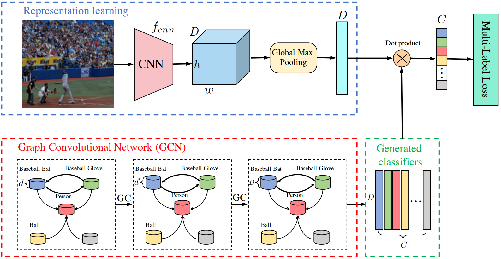

<div align="center">

# Multi-label Image Recognition with GCN and its Variants

<a href="https://github.com/pre-commit/pre-commit"></a>
<a href="https://pytorch.org/get-started/locally/"></a>
<a href="https://pytorchlightning.ai/"></a>
<a href="https://hydra.cc/"></a>
<a href="https://github.com/ashleve/lightning-hydra-template"></a>

<a href="https://arxiv.org/abs/1904.03582"></a>
<a href="https://openaccess.thecvf.com/CVPR2019"></a>

</div>

## Overview
This repo contains an implementation (and a few variants) of the paper [Multi-label Image Recognition with Graph Convolutional Networks](https://arxiv.org/abs/1904.03582). This repo is following [Lightning Hydra](https://github.com/ashleve/lightning-hydra-template) template.

In general, the model is the combination of a CNN-based as the image representation extractor and a GCN-based as the label embedding. Figure 1 describes architecture of the model.

<div align="center">


Figure 1. The overall architecture of the model.
</div>

## Dataset

Currently we have ready-to-use [VOCDectection](https://pytorch.org/vision/stable/generated/torchvision.datasets.VOCDetection.html) pre-processor. More datasets will be added soon.

## Installation
You should have Python 3.7 or higher. I highly recommend creating a virual environment like venv or [Conda](https://docs.conda.io/en/latest/miniconda.html). For example:

```bash
# clone project
git clone https://github.com/thanhtvt/multi-label-gcns.git
cd multi-label-gcns

# [OPTIONAL] create conda environment
conda create -n mlgcn python=3.8
conda activate mlgcn

# install requirements
pip install -r requirements.txt
```

## 🚀 Quick start
### Train
To train model with default configuration:

```bash
# train on CPU
python src/train.py trainer=cpu

# train on GPU
python src/train.py trainer=gpu
```

To train model with chosen experiment configuration from `configs/experiment` folder, run:

```bash
python src/train.py experiment=multi-label_base
```

To override any parameter from commandline, run:

```bash
python src/train.py logger=csv trainer.max_epochs=10
```

### Evaluate
To evaluate model with default configuration:

```bash
python src/eval.py
```

To evaluate model with chosen checkpoint, run:
```bash
python src/eval.py ckpt_path=best-ckpt.ckpt
```